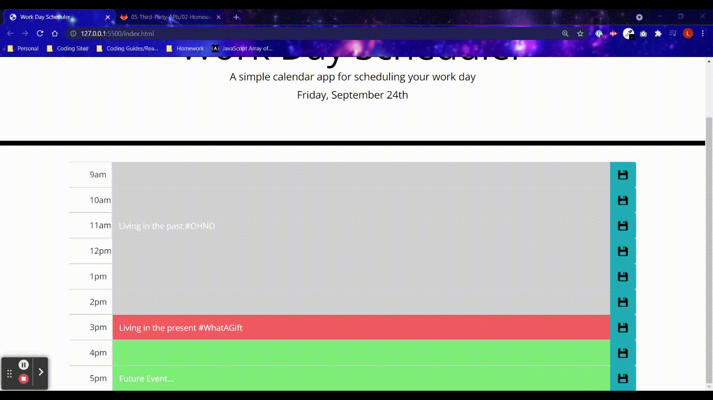

# Work-Planner

## Description
The purpose of this project was to create a daily planner that allows the user to store their agenda in hour time slots.  In addition, the user is able to see the current time with a red background, past time slots in gray, and future time slots in green.  The user is able to save their input upon button click and the data is available after they refresh the page.

This project helped me continue to develop my css and javascript skills.  I was also able to use Moment.js and boostrap to save time styling and coding.  I enjoyed seeing how much my skills have grown.

## User Story

```
AS AN employee with a busy schedule
I WANT to add important events to a daily planner
SO THAT I can manage my time effectively
```

## Acceptance Criteria

```
GIVEN I am using a daily planner to create a schedule
WHEN I open the planner
THEN the current day is displayed at the top of the calendar
WHEN I scroll down
THEN I am presented with timeblocks for standard business hours
WHEN I view the timeblocks for that day
THEN each timeblock is color coded to indicate whether it is in the past, present, or future
WHEN I click into a timeblock
THEN I can enter an event
WHEN I click the save button for that timeblock
THEN the text for that event is saved in local storage
WHEN I refresh the page
THEN the saved events persist
```


# Website Screenshot



# Links

Github: https://github.com/laurelthorburn/Work-Planner

Deployed Site: https://laurelthorburn.github.io/Work-Planner/


# Resources/Credit

* https://stackoverflow.com/questions/62904905/how-do-i-color-code-time-blocks-using-js
* https://www.sitepoint.com/managing-dates-times-using-moment-js/
* https://momentjs.com/docs/#/displaying/
* https://www.w3schools.com/jsref/jsref_number.asp
* https://stackoverflow.com/questions/22680413/how-to-invert-the-color-of-a-png-image-on-mouseover-which-is-inside-a-tag


